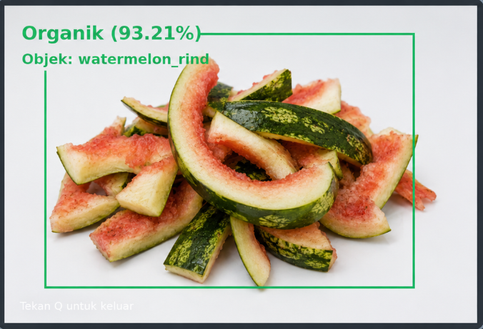
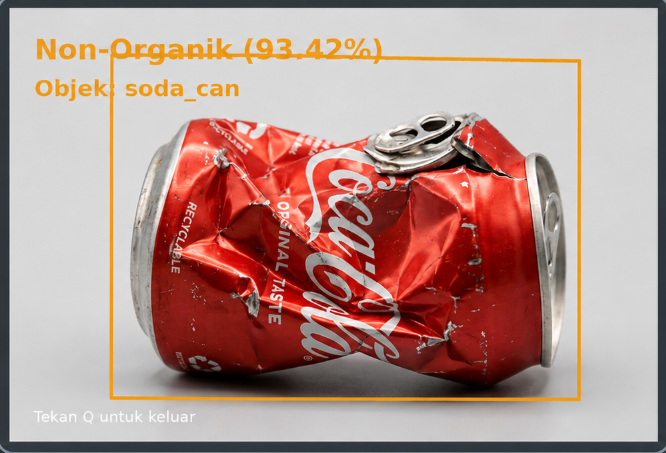

# 🗑️ Smart Waste Classification System


Sistem klasifikasi sampah berbasis **Artificial Intelligence** menggunakan **Python**, **OpenCV**, **TensorFlow**, dan **MobileNetV2** untuk mendeteksi sampah organik dan non-organik secara realtime melalui webcam.

---

## 🎯 Overview

**Smart Waste Classification System** adalah aplikasi AI sederhana yang dapat:

- 🔍 **Mendeteksi objek** dari webcam secara realtime
- 🧠 **Mengklasifikasikan sampah** menjadi organik dan non-organik
- ⚡ **Menggunakan MobileNetV2 pretrained** tanpa training dataset sendiri
- 🌐 **Memproses gambar realtime** menggunakan OpenCV
- 📊 **Menampilkan hasil prediksi** berupa kategori, objek, dan confidence

---

## 📌 Latar Belakang

Permasalahan sampah masih menjadi salah satu masalah lingkungan yang sering terjadi di masyarakat. Sampah yang tidak dikelola dengan baik dapat menyebabkan pencemaran lingkungan, bau tidak sedap, penyumbatan saluran air, banjir, dan gangguan kesehatan.

Salah satu penyebab utama dari masalah tersebut adalah kurangnya pemilahan sampah berdasarkan jenisnya. Sampah organik dan non-organik memiliki cara pengolahan yang berbeda.

Sampah organik seperti sisa makanan, kulit buah, daun, dan sayuran dapat terurai secara alami serta dapat dimanfaatkan menjadi kompos. Sedangkan sampah non-organik seperti plastik, botol, kaleng, dan styrofoam membutuhkan waktu lama untuk terurai dan lebih baik didaur ulang.

Oleh karena itu, dibuat sistem sederhana berbasis Artificial Intelligence yang dapat membantu mengenali jenis sampah menggunakan webcam.

---

## 🎯 Tujuan Project

- Membuat sistem klasifikasi sampah organik dan non-organik
- Mengimplementasikan Artificial Intelligence menggunakan Python
- Menggunakan webcam sebagai input gambar secara realtime
- Menampilkan hasil klasifikasi sampah pada layar
- Membantu proses pemilahan sampah secara sederhana

---

## 🧠 Metode AI

Project ini menggunakan model **MobileNetV2 pretrained** dari TensorFlow/Keras.

MobileNetV2 adalah model deep learning yang sudah dilatih sebelumnya menggunakan dataset besar, sehingga mampu mengenali berbagai objek umum.

Hasil deteksi objek dari MobileNetV2 kemudian dipetakan menjadi dua kategori, yaitu:

| Kategori | Contoh Objek |
|---|---|
| Organik | banana, apple, corn, leaf, food |
| Non-Organik | bottle, can, plastic, paper, cardboard |

---

## 🧩 Alur Sistem

```text
Load Model MobileNetV2
        ↓
Aktifkan Webcam
        ↓
Ambil Gambar dari Kamera
        ↓
Crop Area Tengah
        ↓
Preprocessing Gambar
        ↓
Prediksi Objek
        ↓
Mapping ke Organik / Non-Organik
        ↓
Tampilkan Hasil
```

---

## 📁 Struktur Project

```text
smart-waste-classification/
│
├── README.md
├── requirements.txt
├── start_webcam.bat
│
├── deteksi_webcam.py
├── deteksi_gambar.py
│
└── test_images/
    ├── apple.png
    ├── banana_peel.png
    ├── bottle.png
    └── soda_can.png
```

---

## 📄 Penjelasan File

| File | Fungsi |
|---|---|
| `deteksi_webcam.py` | Program utama untuk menjalankan deteksi sampah menggunakan webcam secara realtime |
| `deteksi_gambar.py` | Program untuk mendeteksi sampah dari file gambar |
| `requirements.txt` | Berisi daftar library yang dibutuhkan |
| `start_webcam.bat` | File untuk menjalankan program webcam secara mudah di Windows |
| `test_images/` | Folder berisi contoh gambar sampah untuk pengujian |
| `README.md` | Dokumentasi project |

---

## 🛠️ Teknologi yang Digunakan

| Teknologi | Fungsi |
|---|---|
| Python | Bahasa pemrograman utama |
| TensorFlow | Menjalankan model AI |
| MobileNetV2 | Model klasifikasi gambar pretrained |
| OpenCV | Mengakses webcam dan menampilkan output |
| NumPy | Mengolah data gambar dalam bentuk array |
| Pillow | Membantu pemrosesan gambar |

---

## 🚀 Cara Install

Pastikan Python sudah terinstall di laptop/PC.

Install semua library dengan perintah:

```bash
python -m pip install -r requirements.txt
```

Jika `python` tidak terbaca, gunakan:

```bash
py -m pip install -r requirements.txt
```

---

## ▶️ Cara Menjalankan Deteksi Webcam

Jalankan perintah berikut:

```bash
python deteksi_webcam.py
```

Atau klik file:

```text
start_webcam.bat
```

Tekan tombol:

```text
Q
```

untuk keluar dari tampilan webcam.

---

## 🖼️ Cara Deteksi Gambar

Untuk mendeteksi gambar dari folder `test_images`, gunakan perintah:

```bash
python deteksi_gambar.py test_images/nama_gambar.png
```

Contoh:

```bash
python deteksi_gambar.py test_images/banana_peel.png
```

---

## 📌 Contoh Output

Contoh hasil deteksi sampah organik:

```text
Objek terdeteksi : banana
Kategori         : Organik
Confidence       : 87.42%
```

Contoh hasil deteksi sampah non-organik:

```text
Objek terdeteksi : water_bottle
Kategori         : Non-Organik
Confidence       : 92.10%
```

---
## 🖼️ Tampilan Hasil Program

### Hasil Deteksi Sampah Organik


### Hasil Deteksi Sampah Non-Organik

## ✅ Kelebihan Sistem

- Deteksi sampah menggunakan webcam secara realtime
- Tidak perlu training dataset sendiri
- Menggunakan model AI pretrained
- Program sederhana dan mudah dipahami
- Cocok untuk pembelajaran dasar Artificial Intelligence
- Menampilkan objek, kategori, dan confidence

---

## ⚠️ Kekurangan Sistem

- Akurasi bergantung pada model MobileNetV2
- Tidak semua jenis sampah dapat dikenali
- Pencahayaan dan background dapat memengaruhi hasil prediksi
- Membutuhkan spesifikasi laptop yang cukup karena menggunakan TensorFlow
- Jika objek tidak ada pada daftar kata kunci, hasil klasifikasi dapat kurang akurat

---

## 📚 Kesimpulan

Sistem pemilahan sampah organik dan non-organik berbasis Artificial Intelligence berhasil dibuat menggunakan **Python**, **OpenCV**, **TensorFlow**, dan **MobileNetV2**.

Sistem dapat mendeteksi objek melalui webcam secara realtime, kemudian mengelompokkan objek tersebut menjadi kategori **organik** atau **non-organik** berdasarkan hasil prediksi model AI.

---

## 🔮 Pengembangan Selanjutnya

Beberapa pengembangan yang dapat dilakukan:

- Menambahkan lebih banyak kata kunci objek sampah
- Menggunakan dataset sampah khusus agar hasil lebih akurat
- Menambahkan fitur suara otomatis
- Menambahkan riwayat hasil deteksi
- Mengembangkan menjadi aplikasi web atau mobile
- Menambahkan kategori sampah lain seperti B3, kaca, logam, dan kertas

---

## 👨‍💻 Pengembang

Nama: 
1.Reza Achmad Alfarizi 
2.Isma Nur hakim
3.Eka Surya
4.Rifki S
Mata Kuliah: Dasar Kecerdasan Buatan
